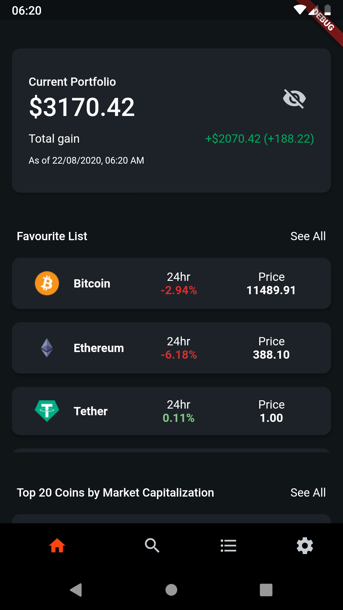
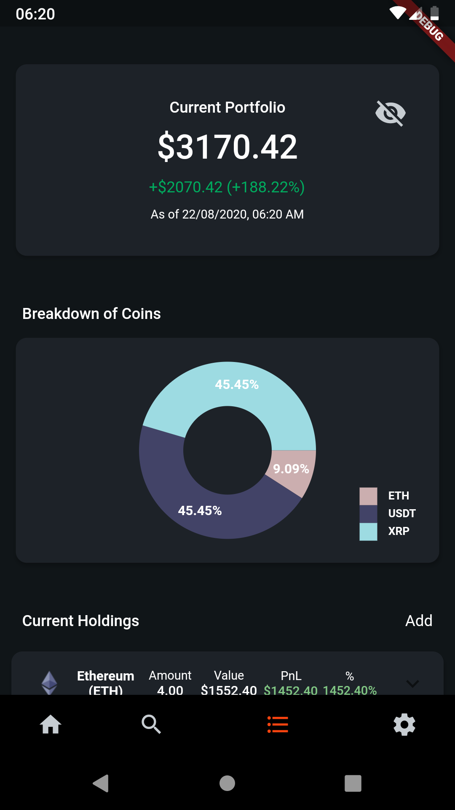

# CryptoFolio

## A portfolio app for your crypto assets

CryptoFolio is a mobile application for anyone who wants to have more control of their crypto assets allocation.

I created this app as a side project for me to test out Flutter as well as the CoinGecko API.

You can download this repository and run this on your phone. Currently this is configured for Android devices.

# Home Page

In the homepage of Cryptofolio, there are 3 sections.

## Portfolio Section

Shows your current portfolio's valuation as well as total gains/loss as of the current time. You will have the ability to hide these numbers for privacy.

## Favourite Section

Shows the coins that you have chosen as favourites in the Search Page.

## Top 20 Coins Section

Shows the Top 20 Coins by Market Capitalization. The 24 hour change in percentage and the current price is displayed.

# Search Page

The **Search Page** displays the Top 100 coins by Market Capitalization. Users will be able to search through these 100 coins and favourite any of these coins by tapping on the heart icon.

# Portfolio Page

In the **Portfolio Page**, there will be 3 sections.

## Portfolio Section

Users will be able to view their current portfolio's valuation and hide the values for privacy.

## Coin Breakdown Pie Chart

Users will be able to view a visual representation of their portfolio in an interactive pie chart.

## Current Holdings

Users are able to add new holdings into their portfolio by tapping on the 'Add' button.

## Editing / Deleting

If there are any mistakes made, users have the ability to edit/delete their previous holdings as well.

# Animated Introduction

CryptoFolio is **Powered by CoinGecko**

